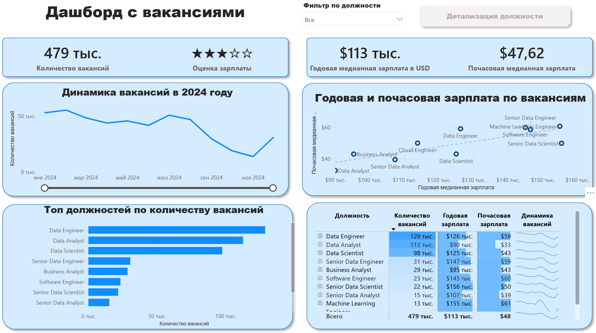

# Дашборд по вакансиям в аналитике в Power BI

## Введение

Этот дашборд создан для всех смотрящих вакансии по аналитике, чтобы решить распространённую проблему: информация о рынке вакансий в сфере аналитики и Data Science разрознена и её сложно воспринимать в целом. Используя реальный набор данных о вакансиях в сфере Data Science за 2024 год (включая названия должностей, зарплаты и местоположение), этот проект предоставляет единый и удобный интерфейс для изучения тенденций рынка и уровня заработных плат.

## Навыки, использованные в проекте

В рамках проекта был разработан интерактивный Power BI-дашборд для анализа рынка вакансий в сфере аналитики. Основные навыки, которые были использованы:

- **Трансформация данных (ETL) с помощью Power Query:** Очистка, преобразование и подготовка исходных данных к анализу: обработка пропусков, изменение типов данных и создание новых столбцов.
- **Неявные меры:** Создание мер для получения ключевых показателей и KPI, таких как Годовая медианная зарплата и Количество вакансий.
- **Основные типы диаграмм:** Использование столбчатых, линейчатых, линейных и площадных диаграмм для сравнения количества вакансий и отслеживания динамики показателей во времени.
- **Географический анализ:** Использование карт для визуализации географического распределения вакансий по всему миру.
- **KPI и таблицы:** Использование карточек для отображения ключевых показателей и таблиц для представления детализированных данных с возможностью сортировки.
- **Дизайн дашборда:** Создание интуитивно понятного и визуально привлекательного интерфейса с использованием как распространённых, так и менее стандартных типов визуализаций для наиболее доступного представления данных.
- **Интерактивная отчётность:**
    - **Срезы:** Для динамической фильтрации отчёта по названию должности.
    - **Кнопки и закладки:** Для создания удобной навигации между разделами отчёта.
    - **Детализация:** Для перехода от сводной информации к контекстному детализированному виду.
---
## Обзор Дашборда

*Этот отчёт разделён на две отдельные страницы для предоставления как обобщённого обзора, так и детального анализа.*

### Страница 1. Общий обзор рынка труда

Это центр управления рынком вакансий в сфере данных. Ключевые показатели (KPI), общее число вакансий, медианные зарплаты и топ должностей. Помогает быстро оценить ситуацию на рынке.

### Страница 2. Детализация по должностям

Страница детального анализа. Перейдите сюда из главного дашборда, чтобы увидеть подробную статистику по конкретной должности: диапазоны зарплат, данные по дистанционной занятости, лучшие платформы для найма и карту вакансий по всему миру

---

### Заключение

Дашборд показывает возможности Power BI по превращению сырых данных о вакансиях в инструмент карьерного анализа. Срезы, фильтры и детализация данных помогут принимать взвешенные карьерные решения.